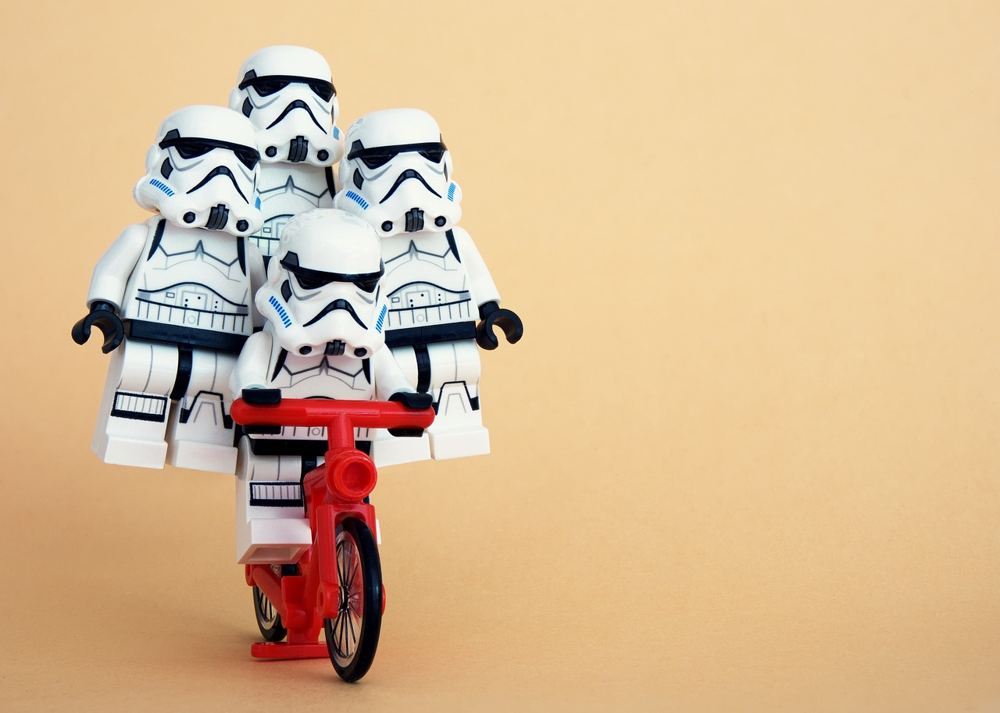
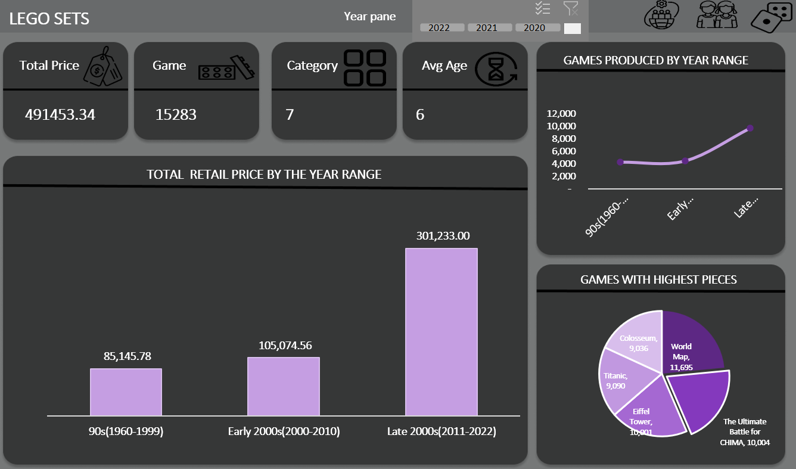
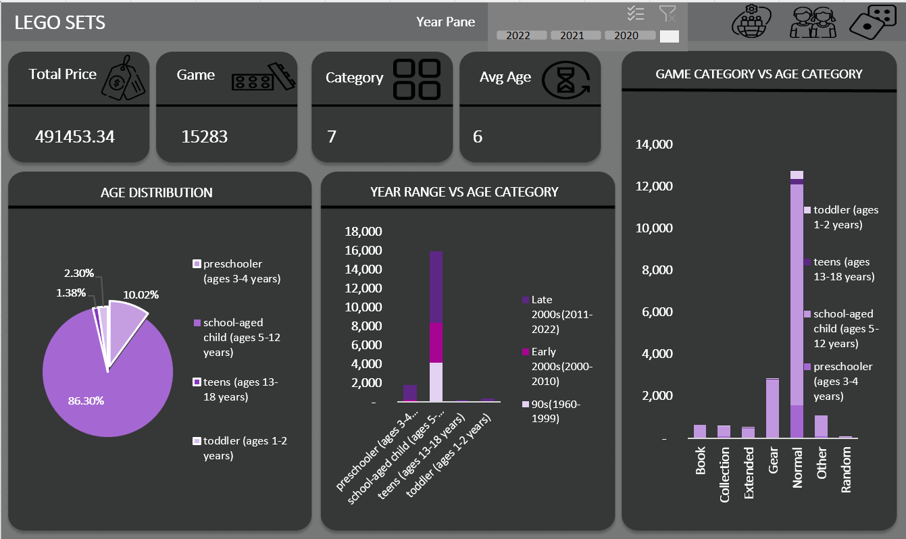
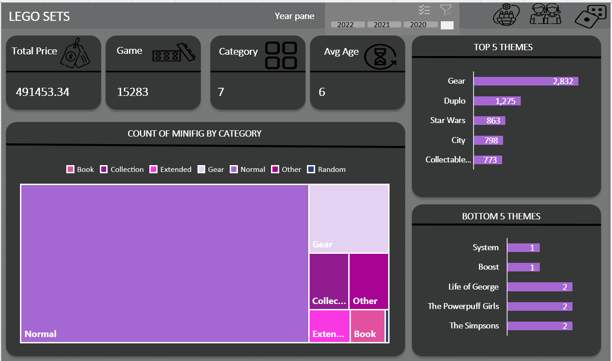

# Lego-Analysis

---
# Introduction
LEGO sets released from 1970 to 2022, including details on each set's theme, pieces, recommended age, retail price, and image.

# Problem Statement
1. What year had the most sales? Also, what year produced the most lego games?
   
3. What games were most prefered amongst the children?
   
5. What theme did the customers love the most? And which did they not like?

# Data Source
This data was gotten from the Maven Analytics playground. Here is the (link) https://mavenanalytics.io/data-playground?search=lego

# Data Cleaning 
The majority of the data cleaning was done using goggle collab(python). DAX measures such as SUM, AVG, DISTINCTCOUNT were used to calculate key information.

# Data Modelling
The data had only one table and as such there is no modelling.

# Data Visualization
The data visualization was carried out on excel. You can interact with the visualization (here) https://eejay98-my.sharepoint.com/:x:/g/personal/faith-tech_eejay98_onmicrosoft_com/EQnzA_5s_S1ArpbRkpF7qM8Boct2H4lYX0PL1NIscYDPYw?e=H7FDYt

# Executive Dashboard

---

# Customer

---

# Game

---

# Insights
1. The most of our sales were made from 2011-2022(Late200s).

2. The games produced saw a drastic increase in the late 2000s.

3. The most loved theme was Gear and the least themes were system, promotional,collectable minifigures and boost with just one theme.

4. School aged children loved playing legos the most, while teens made a very small portion of our data.

5. In our data school aged children tend to love every category of the lego games, but the normal category was the most loved.

6. Late 2000s saw a increase in the number if children who played games.

7. World map had the highest number of pieces being 11695.0, followed by Ultimate Battle for CHIMA with 10004 and Eiffel Tower with 10001.

8. The highest number of minifigs in a game was Normal, followed by gear.

# Recommendation
1. If the company is all about making more money then they should definetely make the school aged children their main target audience

2. The gear theme had the most count in our data and the normal category was the most sort after. So, it is of importance more variations of the normal category be produced.

3. The companies should keep making more legos and if new ideas come about it should be put into it as the rise in lego games overtime has skyrocketed.

4.To make teenagers amongst our target audience, we need to do market survey and find out the type of legos that would be more enjoyable to children around that age.

---
   
